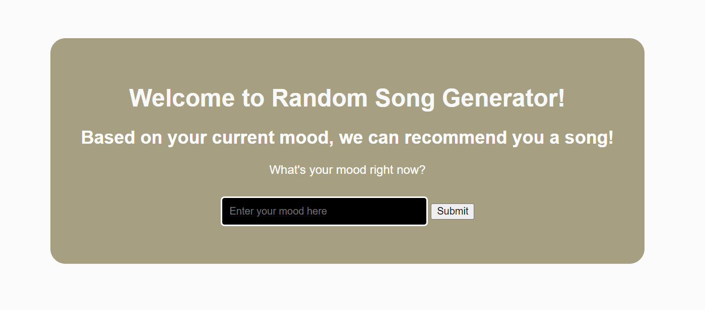
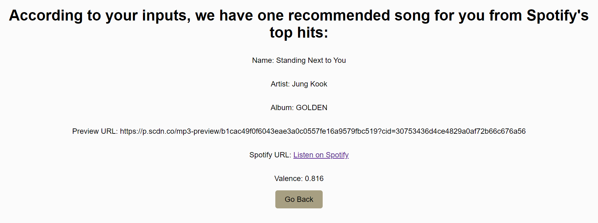
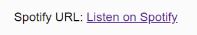

# Python-Project
Group Members:
Jade Liang
Yuefan Cao

# Random Song Generator Based on Mood
The purpose of this website is to generate a song from Spotify's Today's Top Hits based on the user's mood. This allow the site to recommend the user a current popular song that also matches how the user currently feel.

# Why did we do this?
We know we wanted to work on something related to music, so we started off with picking a music API. We started off with wanting to work with the Billboard API, but we discover that would not be feasible because of the lack of information we can pull from the API. So, we pivoted and looked at YouTube's API, Apple Music's API, and Spotify's API. We chose to use Spotify's API because Spotify is an app we are both familiar with, and based on the documentation, there was a lot of data we can work with. In this case, we focused on pulling track ID's from a playlist to extract each track's valence score. We later came up with the idea to categorize songs from a playlist into different moods based on the valence score, and recommend the user a song based on user mood. So, in addition to working with Spotify's API, we used Natural Language Processor to help interpret user input into moods by processing the input and then conducting sentiment analysis on it. We could have used a NLP API, but we thought it would be fun to try to make it ourselves despite knowing how challenging it can be.

# Instruction - How to use this website?:
## Accessing the Website:
- Open your web browser and navigate to the URL of our website.
- Upon arrival, you'll land on the homepage.

## Submitting Your Current Mood:
- Type your current mood or emotions into the provided input field.
- In our code, we made our Natural Language Processor to have the ability to understand many types of user inputs. For example, to convey the phrase "So Happy", a user can input "SooOO HapPPpYYyy", and our NLP can still process this input. Additionally, emoji's can also be processed by converting it to the name of emoji icon.
- Click the submit button to proceed.

## Results Page:
- After submitting your mood, you'll be redirected to a results page (results.html).
- This page displays a randomly selected song based on your input mood.

## Listening to Song:
- On the results page, you'll find the details of the selected song, including the song name, artist album, and Spotify URL.
- Click on the Spotify URL to listen to the song on Spotify.

# Error Handling:
- In case of any errors or issues, such as a page not found or internal server error, you'll be directed to an error page (error_page.html).
- The error page provides information about the encountered error and possible next steps.

# Further Improvement/Limitations:
- To enhance the website further, we could integrate a page dedicated to recommending related artists. The functionality for this already exists in spotify.py, but it hasn't been implemented on the website yet.
- Another further improvement is to add a player on the website where the user can directly play the song preview. Currently, we only have the preview link on the page, where the user can copy the link and paste it to another tab to play it.
- A limitation or challenge we faced was receiving a 429 response code from Spotify, which means that we exceeded the rate limit for the Spotify APl. This meansthat we were making too many requests in a short period of time. This forced us to take a break in our work and come back to it later.